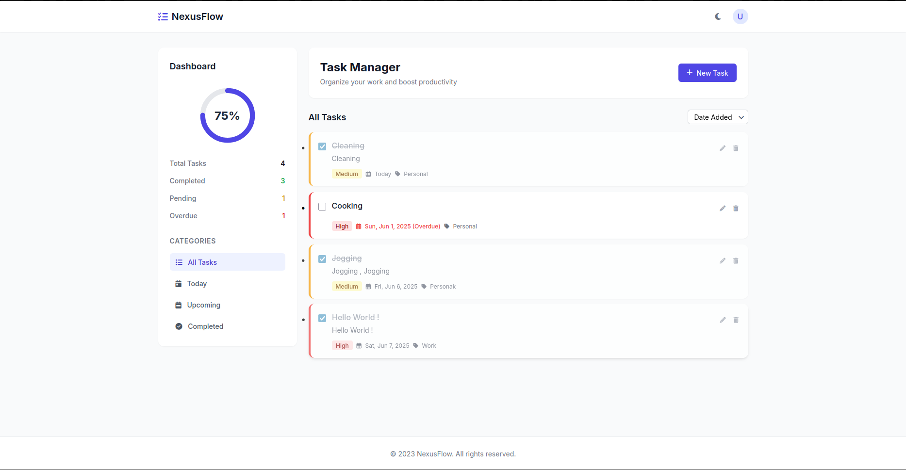

# Task-Manager

### 📋 NexusFlow – Task Management Web App

NexusFlow is a modern and responsive task management web application designed to help users organize, track, and prioritize their daily tasks efficiently. Built with HTML, Tailwind CSS, and Font Awesome, the UI is clean, interactive, and optimized for productivity.
✨ Features:

    Responsive Dashboard with a sidebar for categories, task stats, and a progress ring.

    Add/Edit Tasks Modal with inputs for title, description, due date, priority, category, and tags.

    Task Cards with smooth hover effects and visual priority indicators (high, medium, low).

    Sorting and Filtering options for viewing tasks by date, status, or priority.

    Progress Visualization using SVG-based progress rings to show task completion rate.

    Dark Mode Toggle (Placeholder) for future theming support.

    Empty State UI with call-to-action when no tasks are present.

    Animated UI elements using CSS for smooth transitions and user interactions.

    Font Awesome Icons for a modern and intuitive iconography experience.

  ### Installation :
    1 - Clone repo 
    2 - Put files in a certain folder 
    3 - In Vscode open html file then run it with "Live Server" 
    4 - You're Done ✨

     

  ### Demo : 
  
  

    
